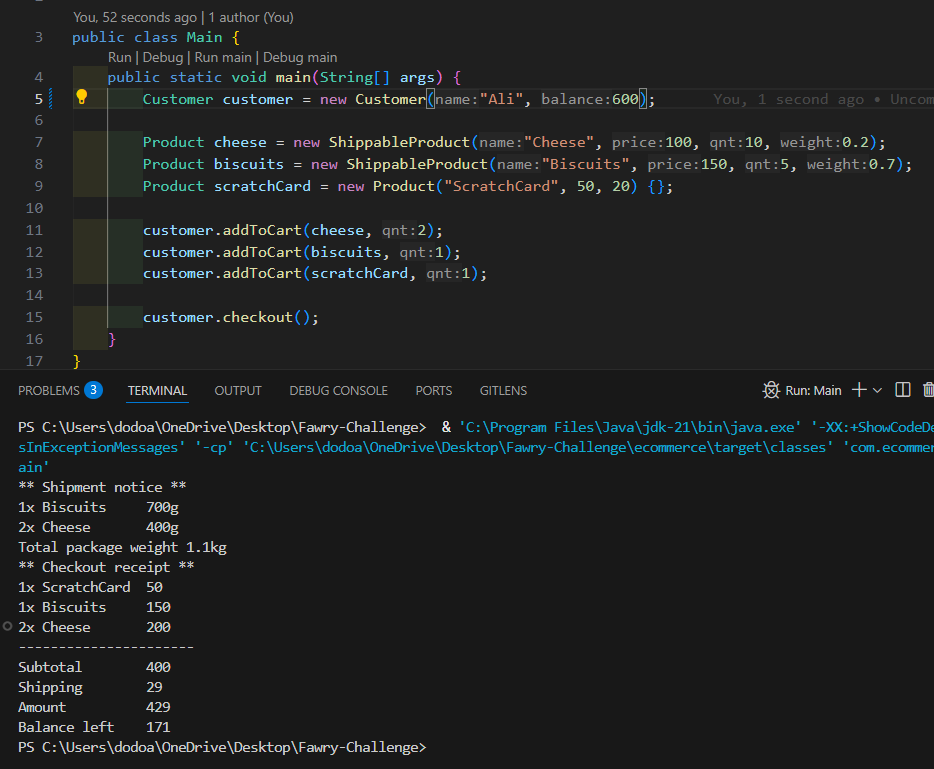

<h1>📦 Fawry-Challenge – Java eCommerce App</h1>

  This is a simple <strong>Java-based eCommerce system</strong> built as part of the Fawry Challenge.
  The application simulates core components of an eCommerce platform like customers, products, and shipping
  services using <strong>object-oriented programming (OOP)</strong> principles in pure Java.

<h2>📸 Screenshot</h2>

Below is a screenshot of the project structure on GitHub:

<h2/>
<h2>📁 Project Structure</h2>

<pre>
src/
└── main/
    └── java/
        └── com/
            └── ecommerce/
                ├── Customer.java
                ├── Main.java
                ├── PerishableProduct.java
                ├── Product.java
                ├── Shippable.java
                ├── ShippableProduct.java
                └── ShippingService.java
</pre>

<!--
💡 Tip: If you're uploading to the root directory, use src="screenshot.png" instead.
Make sure to commit the image file to the repo for it to render correctly.
-->

<h2>🚀 Features</h2>
<ul>
  <li><strong>Customer Management</strong> – Basic customer class to represent users.</li>
  <li><strong>Product Handling</strong> – Includes both regular and perishable product types.</li>
  <li><strong>Shipping System</strong> – Products can be marked as shippable and processed via <code>ShippingService</code>.</li>
  <li><strong>Main Execution</strong> – <code>Main.java</code> simulates system execution.</li>
</ul>

<h2>🛠 Technologies</h2>
<ul>
  <li>Java (Pure OOP, no frameworks)</li>
  <li>No external libraries used</li>
  <li>Console-based application</li>
</ul>

<h2>🧪 How to Run</h2>
<ol>
  <li>Clone the repository: 
    <code>git clone https://github.com/DuaA-A/Fawry-Challenge.git</code>
  </li>
  <li>Compile the source code: 
    <code>javac src/main/java/com/ecommerce/*.java</code>
  </li>
  <li>Run the program: 
    <code>java -cp src/main/java com.ecommerce.Main</code>
  </li>
</ol>

<h2>👩‍💻 Author</h2>

  GitHub: <a href="https://github.com/DuaA-A" target="_blank">DuaA-A</a>

<h2>📄 License</h2>

  This project is licensed for educational use as part of the Fawry coding challenge.

